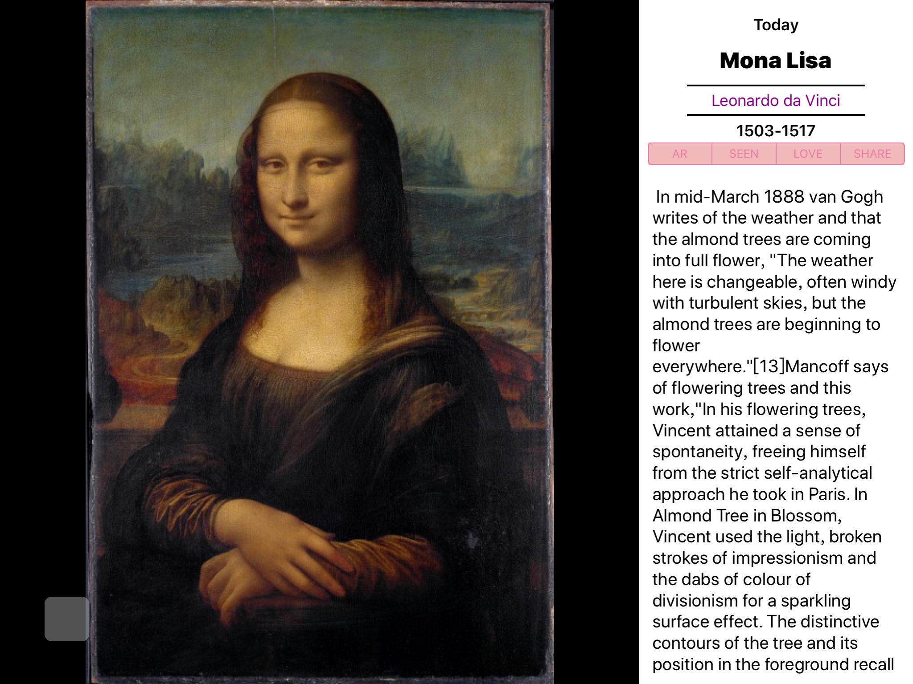
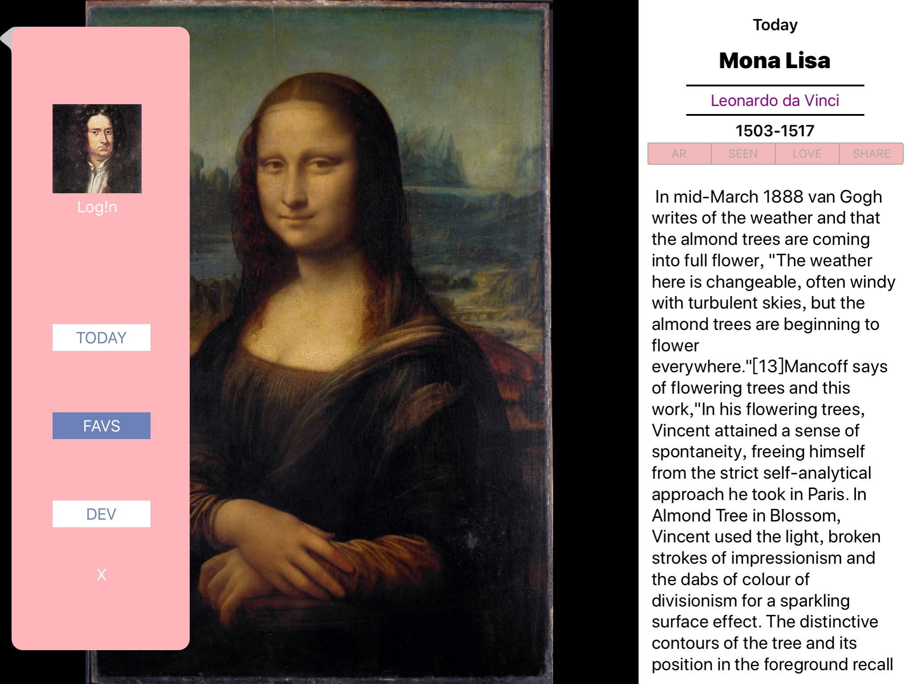
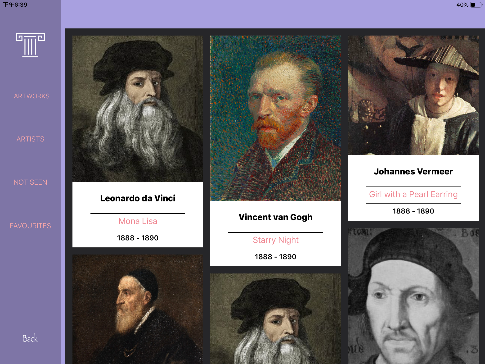

# ARt
remake a  App called ‘DailyArt’  with AR function

## Introduction
我曾经在ipad 上体验到了一款名为 DailyArt 的应用. 这个应用每天将会推荐一件精美绝伦的艺术作品.我感觉这是一个十分具有人文艺术气息的app,当时印象十分好.所以在2018年末,学校4天的短学期项目实训中,我觉得与其一时半会儿想不到一个好idea,不如复刻一个自己觉得还不错的好应用更加让人有动力.于是避免从头开始做繁杂的需求分析,而是分析和修改一些功能和结构即可.对于4天(其实只有2天半)的时间而言这样更加对于技术有帮助.

**DailyArt** : https://apps.apple.com/cn/app/dailyart-free-daily-dose-fine/id547982045

## Main View

**艺术作品**

- 🚀 AR->AR 展示 
- 🔍 竖屏->放大展示
- 📝 文字介绍 

**悬浮按钮**

- 📜 单击 打开关闭 Menu 
- 🎵 双击 打开关闭 Music  

## FAVs

**艺术品 艺术家 未看过 喜欢** 列表

- **cardsView** 是 waterfall 的布局效果

## AR fuction
- utilizing ARKit

